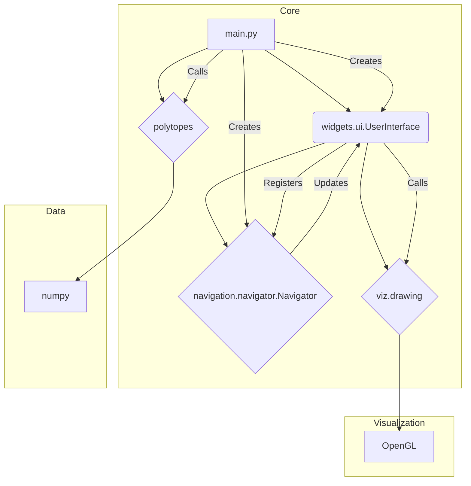
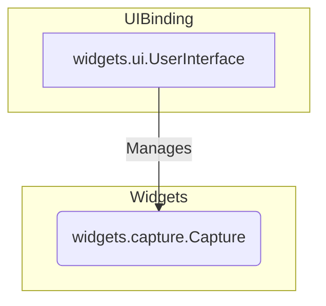

# Class Hierarchy

This document outlines the class hierarchy of the polytope visualization project.

## Core Classes

*   `widgets.ui.UserInterface`: This is the main class that manages the application window, OpenGL context, and user input. It provides a run loop and allows registering callbacks for drawing and input events.

*   `navigation.navigator.Navigator`: This class handles 3D camera rotation based on mouse input. It is initialized with a `UserInterface` instance to register for mouse events. It uses quaternions to represent rotation and can provide a corresponding rotation matrix to be applied to the OpenGL scene.

## Styling Classes

These classes are used to define the visual style of the rendered polytopes.

*   `viz.style.Style`: A container class that holds instances of `PointStyle` and `LineStyle`. It provides a convenient way to manage the overall drawing style.

*   `viz.style.PointStyle`: Defines how vertices (points) of the polytope are rendered. It can be set to simple points (`PointStyle.POINT`) or spheres (`PointStyle.SPHERE`).

*   `viz.style.LineStyle`: Defines how the edges (lines) of the polytope are rendered. It can be set to simple lines (`LineStyle.LINE`) or cylinders (`LineStyle.CYLINDER`).

## Widget Classes

These classes provide additional functionality that can be attached to the `UserInterface`.

*   `widgets.capture.Capture`: This widget allows capturing the current frame as an image file. It is initialized with a `UserInterface` instance and a key binding.

## UML Diagrams

### Core Class Collaboration

### UI and Widget Collaboration

