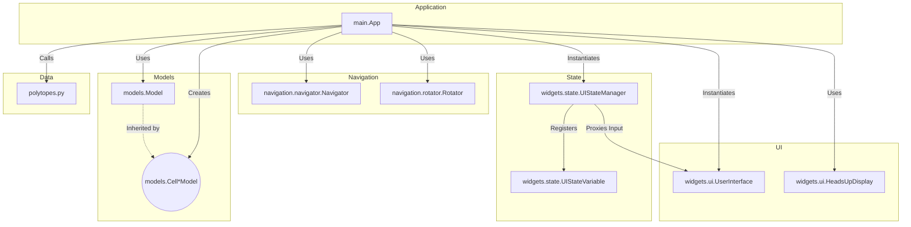

# Class Hierarchy

This document outlines the class hierarchy of the polytope visualization project.

## Core Classes

*   `main.App`: The main application class that orchestrates the entire visualization. It initializes and manages the UI, navigation, and the currently displayed polytope model.

*   `widgets.ui.UserInterface`: This class manages the application window, OpenGL context, and user input. It provides a run loop, allows registering callbacks for drawing and input events, and features an `any_key_callback` mechanism to intercept and consume events (e.g., for the interactive Help Screen overlay).

*   `navigation.navigator.Navigator`: This class handles 3D camera rotation based on mouse input.

*   `navigation.rotator.Rotator`: This class manages the 4D rotation of the polytope.

## Model Classes

These classes represent the polytopes themselves. They encapsulate the geometry (vertices, edges), topological analysis, and coloring information.

*   `models.model.Model`: The abstract base class for all polytope models. It defines the common interface for a model, handles 3D cell extraction and triangulation, and houses the `_compute_chain_groupings` logic which uses Singular Value Decomposition to calculate discrete Hopf topological modes.

*   `models.cell_24_model.Cell24Model`: A concrete implementation of `Model` for the 24-cell polytope. It loads the geometry from `get_24_cell` and defines the specific coloring and style for this shape.

*   `models.cell_120_model.Cell120Model`: A concrete implementation of `Model` for the 120-cell polytope.

*   `models.cell_600_model.Cell600Model`: A concrete implementation of `Model` for the 600-cell polytope.

## Styling Classes

These classes are used to define the visual style of the rendered polytopes.

*   `viz.style.Style`: A container class that holds instances of `PointStyle` and `LineStyle`.

*   `viz.style.PointStyle`: Defines how vertices (points) of the polytope are rendered.

*   `viz.style.LineStyle`: Defines how the edges (lines) of the polytope are rendered.

## Widget Classes

*   `widgets.state.UIStateManager`: Centralized declarative controller for all configuration variables and keybind routing.
*   `widgets.state.UIStateVariable`: Represents an isolated configurable property (e.g., render mode, depth value) with its own cycle limits, keybinding, and help text.
*   `widgets.state.UIAction`: Represents a stateless execution command (e.g., Zoom In, Exit).
*   `widgets.capture.Capture`: This widget allows capturing the current frame as an image file.
*   `widgets.ui.HeadsUpDisplay`: Displays text information on the screen, now populated dynamically via the `UIStateManager`.

## UML Diagrams

### Core Class Collaboration

